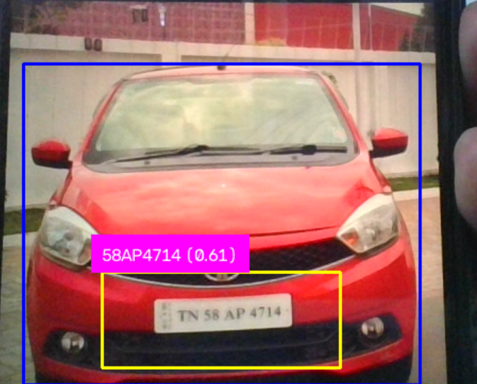

# ANPR — Automatic Number Plate Recognition & Vehicle Entry/Exit Logger

> Real-time license plate detection, OCR, and IN/OUT logging using YOLOv8 + EasyOCR — built as a complete, end-to-end computer vision pipeline.



---

## What it does — in 30 seconds

Point a webcam at a car. The system:
1. **Detects the car** with YOLOv8n (trained on COCO, class `car`)
2. **Crops the plate region** using a bottom-center heuristic
3. **Enhances the crop** with CLAHE contrast normalization + auto-upscaling so OCR works on small/dark plates
4. **Reads the plate text** with EasyOCR, filters garbage reads by confidence + length + letter-digit mix check
5. **Logs IN or OUT** to a CSV file — with fuzzy string matching to handle OCR drift across frames (same plate reading slightly differently each frame)

**CV one-liner:**
> ANPR System — Real-time Number Plate Recognition using YOLOv8 + EasyOCR with CLAHE preprocessing, fuzzy plate deduplication (difflib), and IN/OUT vehicle logging to CSV.

---

## Pipeline

```
Webcam frame
    │
    ▼
detector.py ──── YOLOv8n → car bounding boxes (class 2, conf ≥ 0.3)
    │
    ▼
plate_extractor.py ── heuristic crop: bottom 65–95% × center 20–80% of car box
    │
    ▼
ocr_reader.py ───── CLAHE contrast boost → 2× upscale if crop < 80px tall
    │                → EasyOCR ['en'] → confidence + length + letter/digit filter
    ▼
logger.py ─────── fuzzy match (difflib ≥ 0.65) to group OCR-drifted reads
    │              → cooldown (20s) to avoid logging every frame
    │              → IN / OUT toggle per plate, appended to CSV
    ▼
main.py ─────── draw boxes + plate label on frame, show FPS overlay
```

---

## Key Engineering Decisions

### 1. CLAHE Preprocessing (`ocr_reader.py`)
Raw webcam frames are often low-contrast. Before passing the plate crop to EasyOCR:
- Convert to **grayscale** (removes colour noise; text is inherently high-contrast)
- Apply **CLAHE** (Contrast Limited Adaptive Histogram Equalization) — boosts local contrast without blowing out highlights
- **Auto-upscale** if crop height < 80px — EasyOCR accuracy drops sharply on small crops

### 2. Fuzzy Plate Matching (`logger.py`)
OCR doesn't read the exact same string every frame. `"KA01AB1234"` can come out as `"KA01AB1034"` or `"KA01AB1234E"` on different frames. Without deduplication, each drift would be logged as a brand-new plate.

Fix: `difflib.SequenceMatcher` compares each new reading against recently-seen plates. If similarity ≥ 0.65, the new reading is treated as the same car — collapsing noise onto one canonical plate string.

### 3. IN/OUT Toggle with Cooldown
- First sighting → **IN**
- Next sighting (after 20s cooldown) → **OUT**, then **IN** again, alternating
- Cooldown is in-memory, so it resets on restart (acknowledged limitation — see below)

### 4. Why CSV, not a Database
Chosen deliberately. The project goal is to prove the CV pipeline works end-to-end. A CSV is honest about scope and trivial to swap out — changing only `logger.py` would migrate to SQLite or PostgreSQL.

---

## Project Structure

```
anpr_system/
├── main.py              # entry point — webcam loop + drawing
├── detector.py          # YOLOv8 car detection wrapper
├── plate_extractor.py   # heuristic plate region crop
├── ocr_reader.py        # CLAHE preprocessing + EasyOCR + text filters
├── logger.py            # fuzzy match + cooldown + CSV IN/OUT logger
├── config.py            # all constants in one place
├── requirements.txt
├── demo.png             # demo screenshot
├── yolo-weights/
│   └── yolov8n.pt       # download separately (see Setup)
└── data/
    └── vehicle_log.csv  # auto-created on first run
```

---

## Setup

```bash
# 1. Create and activate a virtual environment
python -m venv venv
venv\Scripts\activate        # Windows
# source venv/bin/activate   # Linux/Mac

# 2. Install dependencies
pip install -r requirements.txt
```

`yolov8n.pt` is auto-downloaded on first run, or place it manually in `yolo-weights/`.

---

## Run

```bash
python main.py
```

Press **`x`** to quit.

The live window shows:
- 🔵 **Blue box** — YOLO car detection
- 🟡 **Cyan box** — heuristic plate region
- White label — `PLATE_TEXT (confidence) - IN/OUT`
- FPS counter (top-left)

Logs are written to `data/vehicle_log.csv`:

```
plate_number,status,timestamp
KA01AB1234,IN,2026-08-29 13:36:00
KA01AB1234,OUT,2026-08-29 13:36:29
```

---

## Docker Deployment

The application is containerized and available on Docker Hub at [sristi1/anpr-system](https://hub.docker.com/r/sristi1/anpr-system). Model weights for YOLOv8 and EasyOCR are pre-downloaded inside the image so it runs completely self-contained.

### 1. Pull the Image
```bash
docker pull sristi1/anpr-system:latest
```

### 2. Run Headless with a Video File
Since Docker containers cannot access local GUIs or display windows by default, run the container in **headless** mode by mounting an input directory containing your video file and an output directory for the CSV log:

```bash
docker run -v ${PWD}/input:/app/input -v ${PWD}/output:/app/data sristi1/anpr-system:latest --source /app/input/video.mp4 --headless
```
*   Place your test video at `./input/video.mp4`.
*   The results will be written to `./output/vehicle_log.csv`.

### 3. Run with Docker Compose
Alternatively, use the provided `docker-compose.yml` to spin up the container:

```bash
docker compose up
```

---

## Tuning (`config.py`)

| Parameter | Default | What it controls |
|---|---|---|
| `CAR_CONF_THRESHOLD` | `0.3` | Min YOLO confidence to count a detection |
| `OCR_CONF_THRESHOLD` | `0.3` | Min EasyOCR confidence to accept a reading |
| `MIN_PLATE_LENGTH` | `6` | Min characters to count as a real plate |
| `LOG_COOLDOWN_SECONDS` | `20` | Seconds between logging the same plate |
| `SIMILARITY_THRESHOLD` | `0.65` | Fuzzy match tolerance (0=any, 1=exact) |
| `PLATE_Y_START_RATIO` | `0.65` | Crop start (% down from top of car box) |
| `PLATE_Y_END_RATIO` | `0.95` | Crop end |
| `DEBUG_SAVE_CROPS` | `False` | Save plate crops to `data/debug_crops/` for tuning |

---

## Known Limitations (interview-ready answers)

| Limitation | Honest answer |
|---|---|
| Plate region is a heuristic | *"I proved the OCR + logging pipeline first. Next step: train YOLO on a plate dataset like CCPD."* |
| OCR accuracy varies | *"Fixed angle, good lighting needed. CLAHE helps significantly. Production needs a resolution check gate before OCR."* |
| CSV not a real DB | *"Deliberate scope choice. Swapping to SQLite changes only `logger.py`."* |
| Cooldown resets on restart | *"In-memory by design for demo scope. Production: persist cooldown state to DB."* |
| Single camera / CPU only | *"One gate, ~5–8 FPS on CPU. GPU + TensorRT → real-time. Multi-gate needs Redis for shared plate state."* |

---

## Possible Next Steps

- Train a YOLO model on a plate dataset (e.g. [CCPD](https://github.com/detectRecog/CCPD)) instead of the heuristic crop
- Add a Streamlit / Tkinter dashboard showing live entry/exit counts
- Migrate logging from CSV → SQLite
- Plate format validation (regex for country-specific patterns)
- GPU inference (ultralytics supports CUDA out of the box)
- Redis-backed shared plate state for multi-gate deployments
